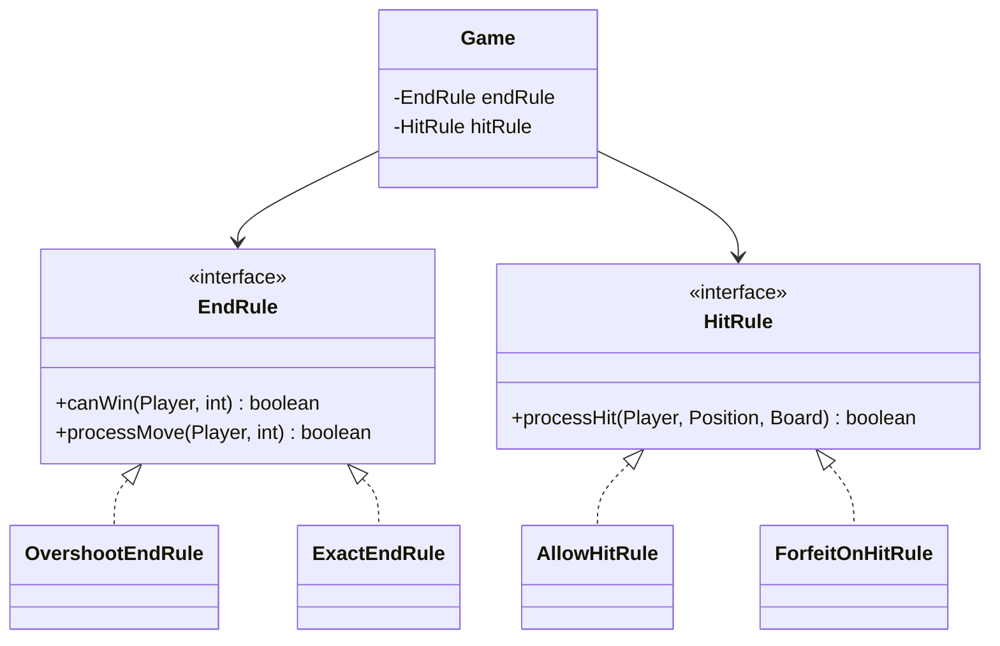
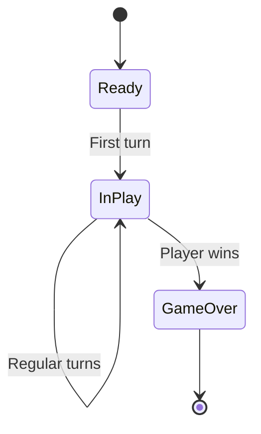
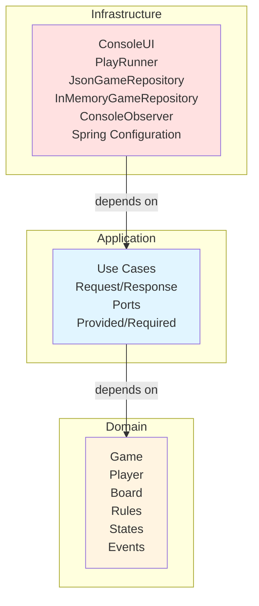

# Simple Frustration Game - Design Documentation

---

•	The variations and advanced features attempted and their design.
•	An explanation of where and why design patterns have been used (naming the design pattern).
•	An explanation of where and why SOLID principles have been followed (naming the principle).
•	An explanation of how you have applied clean or “ports and adapters” architecture with reference to dependencies 
•	An evaluation of your implementation.


### Variations and Advanced Features

1. **Single Dice:**
This variation has been implemented using the `RandomDiceRoller` class which generates a random number between 1 and 6, 
in the other variations where 2 dice are required the `TwoDiceDecorator` is wrapped around the `RandomDiceRoller` to 
two dice.

2. **Exact Landing:**
This variation has been implemented using the strategy pattern. The `EndRule` interface has two implementations 
`ExactEndRule` and `OvershootEndRule` which can be swapped in and out of the `Game` class to change the 
end rule behaviour at runtime. (check)

3. **Forfeit on Hit:**
This variation has also been implemented using the strategy pattern. The `HitRule` interface has two implementations 
`AllowHitRule` and `ForfeitOnHitRule` which can be swapped in and out of the `Game` class to change the hit rule behaviour at runtime. 
(check)

4. **Large Board:**
This variation has been implemented using the factory pattern. The `BoardFactory` class is responsible for creating 
either a `BasicBoard` or a `Largeboard` depending on the configuration passed to it. This encapsulates the board creation 
logic and ensures the code is open for extension in this area. (check)

mayebe add ????`Board` instance based on the `GameConfiguration`. This encapsulates the board creation logic and allows for easy addition of new board types in the future. (check)

5. **Game States**


**Problem domain:** Board game with multiple variations (single/two dice, exact landing, forfeit on hit, large board with 4 players). Without patterns, supporting these variations leads to:
- Conditional logic scattered throughout codebase
- Duplication between similar game modes
- Tight coupling between game logic and infrastructure
- Difficulty testing and extending

**Solution approach:** Apply design patterns strategically where they solve actual problems, not for pattern's sake.

### Why Clean Architecture?

**Goal:** Separate business logic from technical implementation details. Domain code should not depend on frameworks, databases, or UI - these are implementation details that change more frequently than business rules.

**Benefit:** Can test game logic without Spring, switch from JSON to database storage without touching game rules, or add GUI without modifying domain code.

---

## Software Design Techniques

### Design Patterns Applied

#### Factory Pattern

**Problem solved:** Board and player creation duplicated between play and replay use cases. Adding large board variation would require identical changes in multiple places.

**Implementation:**
```java
public class BoardFactory {
    public static Board createBoard(GameConfiguration config) {
        return config.isLargeBoard() ? new LargeBoard() : new BasicBoard();
    }
}
```

**Benefits:**
- Single source of truth for object creation
- Encapsulates creation logic
- Open/Closed Principle - new board types added without modifying use cases

#### Strategy Pattern (Core Extensibility)

**Problem solved:** Game has variable rules (exact landing vs overshoot, allow hits vs forfeit). Initially implemented with conditionals - adding new variations required modifying Game class.

**Implementation:**


**Why this matters:**
- **Open/Closed Principle demonstrated:** Game class closed for modification, open for extension
- **Combinatorial flexibility:** Can mix any EndRule with any HitRule without creating subclasses
- **Eliminated conditionals:** No `if (exactLanding)` checks scattered through code

**Alternative rejected:** Subclassing Game for each variation creates explosion (BasicGame, ExactLandingGame, ForfeitOnHitGame, ExactLandingForfeitOnHitGame...). Strategy pattern avoids this.

**Strategy also applies to persistence:** `GameRepository` interface with `JsonGameRepository` and `InMemoryGameRepository` implementations. Configuration file determines which implementation Spring injects - zero code changes needed to switch.

**Real-world benefit:** Adding "safe zones" variation requires only implementing new `HitRule`. Game, Player, Board unchanged.

#### Decorator Pattern

**Problem solved:** Need composable dice behaviors (random, two-dice summation, recording). Inheritance creates rigid hierarchy preventing combinations.

**Implementation:**
```java
DiceRoller dice = new RecordingDiceRoller(
    new TwoDiceDecorator(new RandomDiceRoller())
);
```

**Why composition over inheritance:**
- Can wrap any dice roller with any decorator
- Behaviors compose at runtime
- No class explosion (vs RandomDice, TwoDiceRandom, RecordingDice, RecordingTwoDice...)

**Benefits:**
- Flexible behavior composition
- Single Responsibility - each decorator does one thing
- Runtime configuration of dice behavior

#### State Pattern

**Problem solved:** Game lifecycle has distinct phases (ready, in play, game over) with different behaviors. Without State pattern, `takeTurn()` method filled with conditionals checking current phase.


**Benefits:**
- Eliminates conditional logic - each state encapsulates its behavior
- State transitions explicit and controlled
- Open/Closed - new states (PausedState) add without modifying Game
- Single Responsibility - each state class handles one phase

**Design decision:** Simple instantiation rather than singleton. States are stateless, so singleton complexity unjustified (KISS principle).

#### Observer Pattern

**Problem solved:** Game logic tightly coupled to console output via `System.out.println()` calls throughout. Prevented testing without output, made alternative interfaces (GUI, logging) impossible.

**Implementation:**
```java
public interface GameObserver {
    void onGameEvent(GameEvent event);
}
```

**Benefits:**
- Complete decoupling - game broadcasts events, observers handle presentation
- Multiple observers possible (console + file logger + GUI)
- Domain code testable without I/O
- Event immutability prevents observers modifying game state

**Infrastructure integration:** Observer injected directly into use cases via Spring DI. No factory needed - only one observer type currently exists, so factory would be premature abstraction.

#### Repository Pattern

**Problem solved:** Persistence concerns shouldn't leak into use cases or domain. Storage mechanism (JSON files, in-memory, database) is implementation detail.

**Implementation:**
```java
public interface GameRepository {
    void save(GameRecord record);
    Optional<GameRecord> findById(GameId id);
}
```

**Benefits:**
- Use cases depend on interface, not concrete storage
- Tests use `InMemoryGameRepository` (fast, no I/O)
- Production uses `JsonGameRepository` (persistent)
- Switching storage = configuration change, no code modification
- Dependency Inversion Principle - high-level use cases don't depend on low-level storage

**Design decision:** Direct implementations (JsonGameRepository, InMemoryGameRepository) rather than additional wrapper layer. Strategy pattern demonstrated through Spring DI selecting implementation.

### SOLID Principles

**Single Responsibility Principle:**
Each class has one reason to change. `Player` manages player state. `Game` orchestrates gameplay. `ConsoleGameObserver` handles output. Initial violation found: observer was printing configuration - extracted to `ConfigurationPrinter` utility.

**Open/Closed Principle:**
System extensible without modification. New rules via interface implementation. New dice behaviors via decorators. New boards via inheritance. Adding "safe zones" variation requires only new `HitRule` implementation - Game, Player, Board unchanged.

**Liskov Substitution Principle:**
Any implementation substitutes for its interface without breaking behavior. Any `DiceRoller` works identically. Any `Board` functions the same. Any `EndRule` or `HitRule` swappable without side effects.

**Interface Segregation Principle:**
Focused, minimal interfaces. `DiceRoller` has one method. `EndRule` has two focused methods. `HitRule` has one method. Clients depend only on methods they use.

**Dependency Inversion Principle:**
High-level modules depend on abstractions, not concretions. Use cases depend on `GameRepository` interface. `Game` depends on `EndRule`/`HitRule` interfaces. Domain has zero infrastructure dependencies. Demonstrated throughout architecture.

---

## Clean Architecture Application

### Architectural Goals

**Primary objective:** Isolate business logic from technical implementation. Game rules should not know about Spring, JSON, or file systems. Infrastructure details change - business rules are stable.

**Testability goal:** Test domain logic without frameworks or I/O. Unit tests should run in milliseconds.

**Flexibility goal:** Swap infrastructure components (storage, UI) without touching business logic.

### Layer Structure & Dependency Rule


**Dependency rule:** Dependencies point inward only. Outer layers know about inner layers. Inner layers know nothing about outer layers.

**Domain Layer:**
Pure business logic. Game, Player, Board, Rules, States, Events. Zero framework dependencies. No Spring annotations, no Jackson, no file I/O. Just Java and business rules. Domain objects immutable where possible (GameConfiguration, GameId, Position).

**Application Layer:**
Use cases orchestrating domain objects. Defines ports (interfaces) specifying what infrastructure must provide. Use cases implement Provided ports (what they offer) and require Required ports (what they need). This layer knows domain but not infrastructure.

**Infrastructure Layer:**
Technical implementation details. Driving adapters (ConsoleUI, PlayRunner) invoke use cases. Driven adapters (JsonGameRepository, InMemoryGameRepository, ConsoleGameObserver) implement required ports. Spring `AppConfig` is composition root wiring dependencies.

### Request/Response Pattern

**Rationale:** Use cases need explicit contracts independent of delivery mechanism (console, web, tests). Request/Response objects provide these contracts.

**Play use case:**
```java
public record PlayRequest(GameConfiguration configuration, DiceRoller dice) {}
public record PlayResponse(GameId gameId, PlayerColour winner, int totalTurns,
                           boolean success, String errorMessage) {}
```

**Benefits achieved:**
1. **Explicit contracts** - Clear documentation of inputs/outputs
2. **Framework independence** - Same request from console, HTTP, or test
3. **Testability** - Create simple request objects, no mocking infrastructure
4. **Type safety** - Compiler enforces correct usage
5. **Immutability** - Records prevent accidental modification
6. **Error handling** - Success/failure encapsulated in response

**Error handling strategy:** Use cases catch exceptions, return failure responses with error messages. Callers check success flag and handle appropriately. Keeps error handling at boundaries, not scattered through domain.

### Ports and Adapters (Hexagonal Architecture)

**Ports (Interfaces):**

Provided ports - what use cases offer:
```java
public interface Provided {
    PlayResponse execute(PlayRequest request);
}
```

Required ports - what use cases need:
```java
public interface Required {
    interface GameRepository {
        void save(GameRecord record);
        Optional<GameRecord> findById(GameId id);
    }
}
```

**Adapters (Implementations):**

Infrastructure `GameRepository` implements both use case ports. Concrete adapters (`JsonGameRepository`, `InMemoryGameRepository`) implement infrastructure interface. This indirection allows use cases to remain infrastructure-agnostic.

**Why this matters:**
- Use cases test with in-memory adapter (fast, no I/O)
- Production uses JSON adapter (persistent storage)
- Could add database adapter without touching use cases
- Ports define contracts - adapters fulfill contracts

### Dependency Injection with Spring

**Why dependency injection:** Manual wiring becomes error-prone and inflexible with many dependencies. Spring provides declarative configuration and lifecycle management.

**Configuration over code:**
```java
@Bean
public GameRepository gameRepository() {
    return switch (persistenceStrategy) {
        case "json" -> new JsonGameRepository();
        case "memory" -> new InMemoryGameRepository();
        default -> new InMemoryGameRepository();
    };
}
```

Strategy selection via configuration file:
```properties
game.persistence.strategy=json
```

**Benefit:** Switch persistence without recompiling. Configuration change, not code change.

### Architecture Benefits Realized

**Testability achieved:**
- Domain tests use simple Java objects, no frameworks
- Use case tests inject in-memory repositories
- No file I/O in 80+ tests = millisecond execution
- Integration tests verify full stack

**Flexibility demonstrated:**
- Swapped observer implementations without touching domain
- Repository strategy configured, not coded
- Could add GUI by implementing new observer
- Could add database by implementing new repository adapter

**Independence maintained:**
- Business rules don't reference Spring
- Domain code portable to any Java environment
- Use cases runnable in web, desktop, mobile contexts
- Framework changes don't ripple into business logic

**Maintenance improved:**
- Changes isolated to appropriate layers
- Persistence changes don't affect domain
- UI changes don't affect business logic
- Each layer evolves independently

---

## Critical Design Decisions

### Dice Sequence Storage vs Output Text

**Decision:** Store dice roll sequences, replay game logic.

**Rationale:**
- Compact storage (integers vs full text)
- Output format changeable without re-recording
- Proves determinism - same sequence always produces same result
- Enables state inspection at any point

**Trade-off:** Requires replay logic and fixed sequence dice roller. Alternative (storing output text) is simpler but inflexible and larger.

### Repository Strategy Implementation

**Decision:** Direct implementations (JsonGameRepository, InMemoryGameRepository) instead of additional wrapper layer.

**Rationale:**
- Strategy pattern demonstrated via Spring DI
- Additional wrapper adds no value - just delegates
- Simpler architecture - fewer layers
- YAGNI principle - don't add complexity without clear benefit

### Observer Injection Approach

**Decision:** Pass observer directly to use cases, not via factory.

**Rationale:**
- Only one observer type exists currently
- ObserverFactory would be premature abstraction
- Simpler dependency injection
- Factory useful when creating multiple types - not applicable here

### State Pattern Simplification

**Decision:** Simple state instantiation rather than singleton pattern.

**Rationale:**
- States are stateless - no shared data
- No threading concerns in application
- KISS principle - simpler is better
- Singleton adds complexity without benefit

**Learning:** Initially over-engineered with synchronized lazy initialization. Refactored when realizing states don't require sharing.

### Turn Processing Order

**Decision:** Check end rule before hit rule in turn processing.

**Rationale:** Player should win even if landing on occupied position at game end. Hit rule shouldn't override winning condition.

**Bug found:** Initial implementation checked hit rule first, allowing forfeit on winning move. Design principle: operation order matters when rules interact.

---

## Evaluation

### Strengths

**Pattern appropriateness:** Each pattern solves actual problem. Strategy eliminates conditionals. Decorator enables composition. Observer decouples presentation. Repository abstracts storage. Not pattern-for-pattern's-sake.

**Architecture clarity:** Clean separation of concerns. Domain pure and testable. Use cases coordinate without infrastructure knowledge. Infrastructure adapts to domain requirements.

**Extensibility demonstrated:** Adding variations requires implementing interfaces, not modifying existing code. Open/Closed Principle throughout.

**Comprehensive testing:** 80+ tests cover domain, use cases, integration. Clean architecture enables fast, isolated tests.

### Limitations and Future Work

**Input validation:** System assumes valid configurations. Production requires defensive validation on GameConfiguration.

**Error handling:** Focused on happy path. More comprehensive exception handling needed for production.

**Concurrency:** Single-threaded design. Network multiplayer requires thread-safe collections and synchronization.

**Performance:** Correctness prioritized over optimization. Benchmarking different persistence strategies would inform production decisions.

**Additional variations:** Could demonstrate more pattern applications:
- Safe zones (new HitRule)
- Board shortcuts (Board enhancement)
- Power-up positions (new domain concept)

### Key Learning

**Simplicity valuable:** Initial singleton states over-engineered. Simpler instantiation sufficient. KISS principle important.

**Patterns solve problems:** Strategy pattern value became clear when adding third variation - conditionals would have become unmaintainable.

**Architecture enables testing:** Clean Architecture separation made comprehensive testing feasible. Domain tests run in milliseconds without I/O.

**Dependency direction matters:** Initial attempts violated dependency rule (infrastructure importing domain). Understanding inward dependencies took iteration.

---

**Word Count:** ~1,950 words (excluding code and diagrams)

*Note: Focused on design justification and architectural reasoning rather than game rules or setup instructions. Can trim evaluation section if strict 1500-word limit required.*